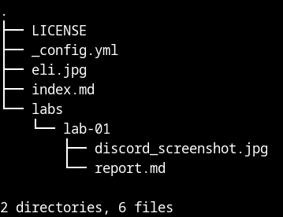
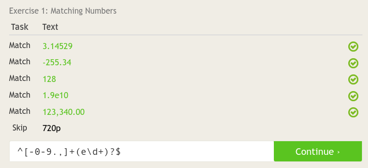
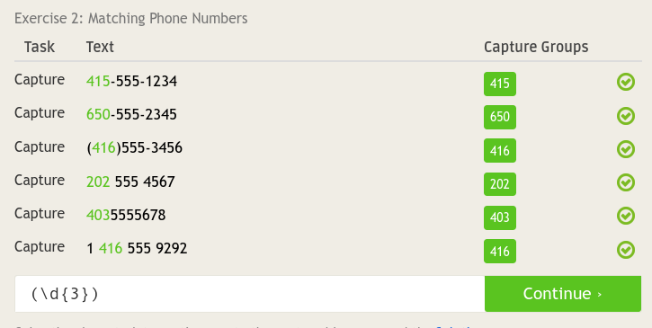
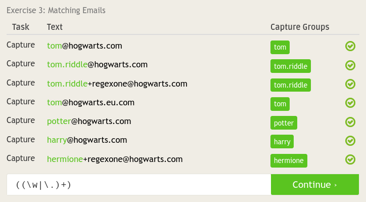
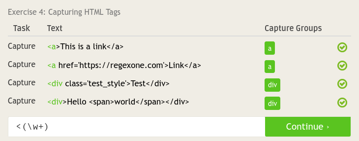
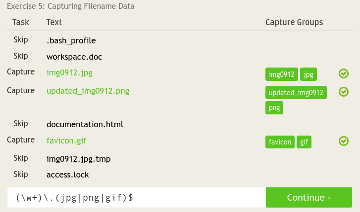
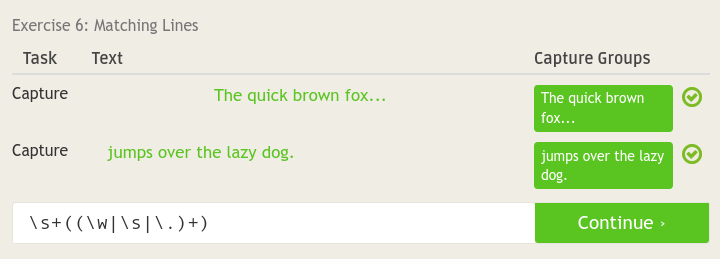
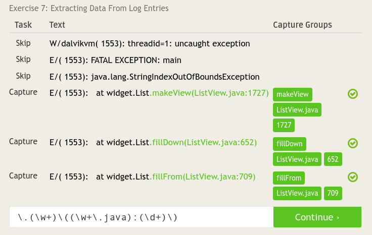
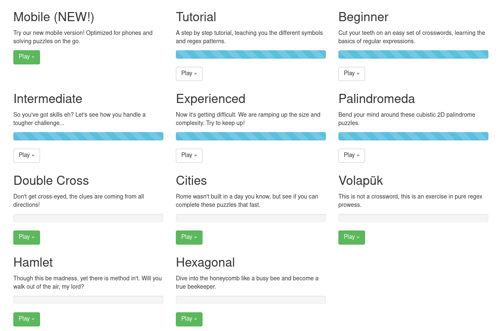
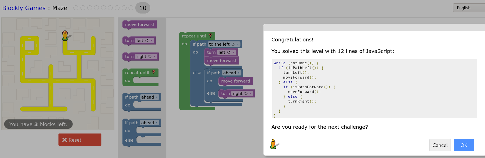

# Lab 01 Report - Introduction to Open Source Software

## 1 Create and setup a Github account

#### Question 3
Discord: blackboard#2645

Photo of Me: 

#### Question 4

## 2 Reading assignments - make sure to reflect on these in a lab1.md file in your repository

#### Question 3
1. It is usually a good idea to make sure that the person you are asking your question to understands your question. Sometimes you need to rephrase your question so that they can better understand it.
2. Splitting up a large question into smaller more manageable questions can help the other person understand it and provide relevant answers without getting confused.

#### Question 4
What sticks out to me is how the narrative gets spun by the different groups involved. The RIAA does not care that they are spinning the story, and in the process hurting Jesse. He had no intention of helping pirates and he was not even a pirate himself. Yet that did not seem to matter. Even RPI currently seems to spin this story as if Jesse was a pirate. When we were in orientation, RPI told us this story. But the way RPI told it, there was an RPI student who pirated a lot of music and got caught. Nowhere did they mention that in fact all he did was make a free tool to help other students find files. And in the process he uncovered piracy. It is easy to at first hear a story from one side and think they are correct, which is why often listing to multiple sources is a good idea to get the full picture.

## 3 Linux
#### Question 3

## 4 Regex
#### Question 1

#### Question 2
I have actually already done a lot of this. Here is my proof of solving all the puzzles up through "Palindromeda" including the required beginner puzzles

## 5
#### Question 2
Here is my proof of solving the puzzle using blockly

## 6
