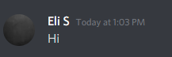

# Lab 01 Report - Introduction to Open Source Software

## 1

## 2
1. When asking a question make sure you are asking the right question, sometimes people ask a related question but being direct is the best way to ask a question.
2. If the person you are asking is confused by your question. It is smart to rephrase your question to make it more clear.

## 3

What sticks out to me is how the natative gets spun by the different groups involved. The RIAA does not care that they are spinning the story, and in the process hurting Jesse. He had no intention of helping pirates and he was not even a pirate himself. Yet that did not seem to matter. Even RPI currently seems to spin this story as if Jesse was a prirate. When we were in orientation, RPI told us this story. But the way RPI told it, there was an RPI student who pirated a lot of music and got caught. Nowhere did they mention that in fact all he did was make a free tool to help other students find files. And in the process he uncovered piracy. It is easy to at first hear a story from one side and think they are correct, which is why often listing to multiple sources is a good idea to get the full picture.

