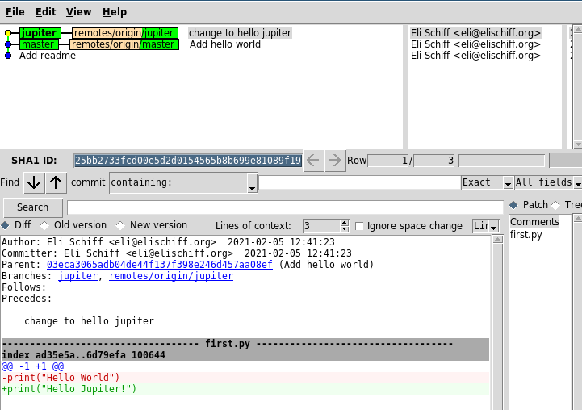
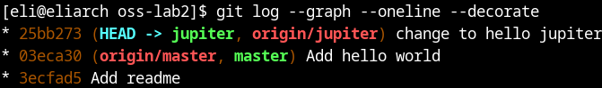
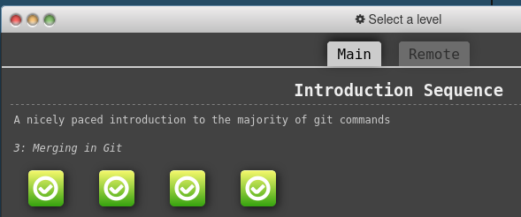
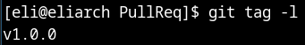

# Part 1
##### My new repo
https://github.com/elihschiff/lab2part1

##### gitk

##### gitk --all

##### git log --graph --oneline --decorate

# Part 2
https://github.com/elihschiff/Spoon-Knife

##### gitbranching first 4 levels

# Part 3
##### My forked repo
https://github.com/elihschiff/PullReq

##### git diff HEAD~1

##### git tag -l

##### Fork of project ideas
https://github.com/elihschiff/OSSProjectIdeas
