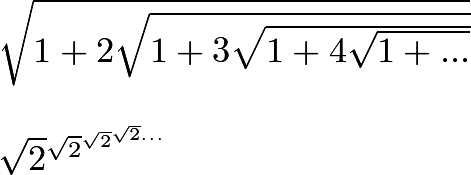
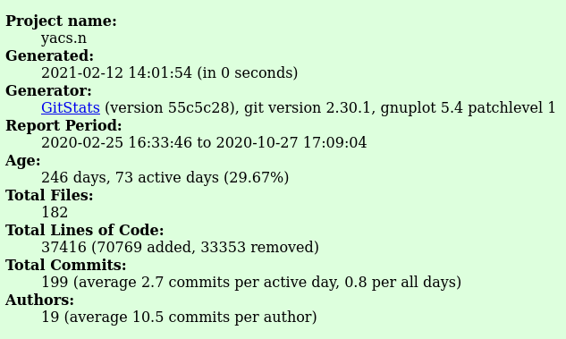
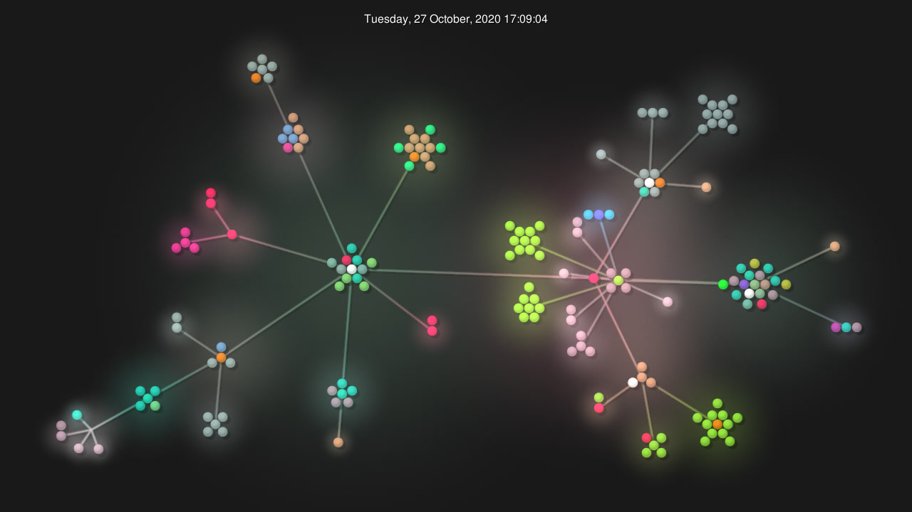

# Part 1 - Documentation
##### Wiki page
https://github.com/elihschiff/oss-repo-template/wiki/Project-ideas

##### Latex code
```latex
$\sqrt{1+2\sqrt{1+3\sqrt{1+4\sqrt{1+...}}}}$

$\sqrt{2}\textsuperscript{$\sqrt{2}\textsuperscript{$\sqrt{2}\textsuperscript{$\sqrt{2}...$}$}$}$
```



##### Hadamard Matrix of size 4
```latex
$H_4 = \begin{bmatrix}
1 & 1 & 1 & 1\\
-1 & 1 & -1 & 1\\
-1 & -1 & 1 & 1\\
1 & -1 & -1 & 1
\end{bmatrix}$
```


# Part 2 - Community
##### Yacs
* the number of contributors: 18
* number of lines of code: 37426
* the first commit: https://github.com/YACS-RCOS/yacs.n/commit/58002dc5c721061a78a91a745f66d4833ad1468b
* the latest commit: https://github.com/YACS-RCOS/yacs.n/commit/91062273d905d14a7ce30c9a5d13ccbaf3b2fe7d
* the current branches:
```
  remotes/origin/#230
  remotes/origin/#246
  remotes/origin/HEAD -> origin/master
  remotes/origin/HTTPS
  remotes/origin/add_vuex
  remotes/origin/admin_panel_ui
  remotes/origin/credit_info
  remotes/origin/dark-mode
  remotes/origin/master
  remotes/origin/page_for_department
  remotes/origin/showDatabaseError
  remotes/origin/summer2020-demo
  remotes/origin/windows-dev-docs
  remotes/origin/windows_support
  ```

  Here is a link with all the other information from the members of my group if you would like to take a look:
  [other data](data.pdf)

##### Gitstats
As to be expected the results from gitstats are the same for data I collected such as line numbers. Gitstats however takes theses results one step further. For example it shows that yacs has added 70769 lines and removed 33353 lines of code. It is also interesting to see that they have .8 commits per day and that the project is 246 days old. The ammount of graphs and other



##### Gource
Click this image to view the video
[](https://github.com/elihschiff/oss-repo-template/raw/master/labs/lab-03/gource.mp4 "Gource Video")
