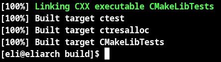
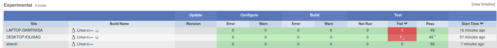
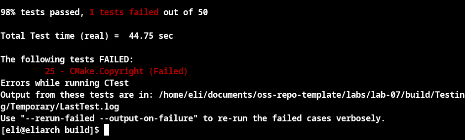
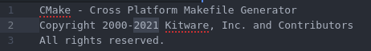
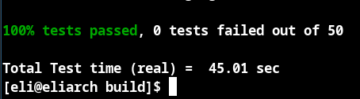
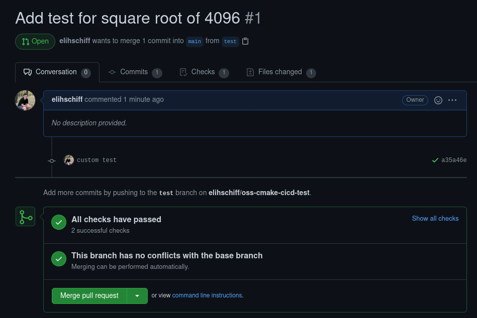
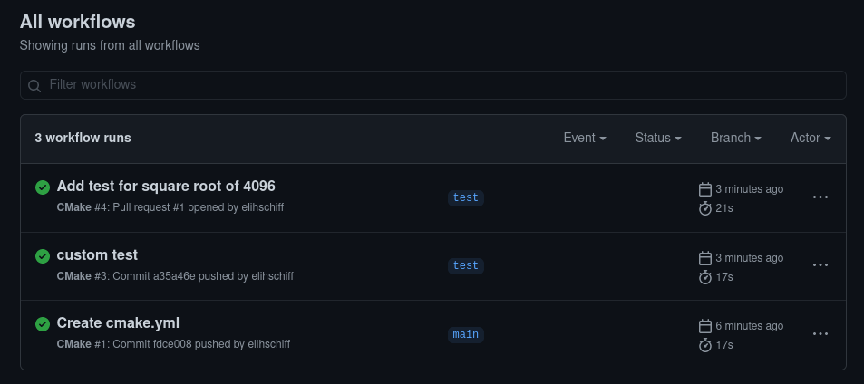

# Checkpoint 1
> Add a screenshot of the successful, build complete message to your Lab notebook

# Checkpoint 2
My results are the bottom row `eliarch`

# Checkpoint 3
This is what my terminal outputted when my test failed

The issue was that the date in the Copyright.txt was 2020 not 2021
I fixed that by changing the date and it fixed the tests

Here is my fixed file (I highlighted the value I changed)

Here is proof the tests passed after I fixed the file

# Checkpoint 3
https://github.com/elihschiff/oss-cmake-cicd-test

