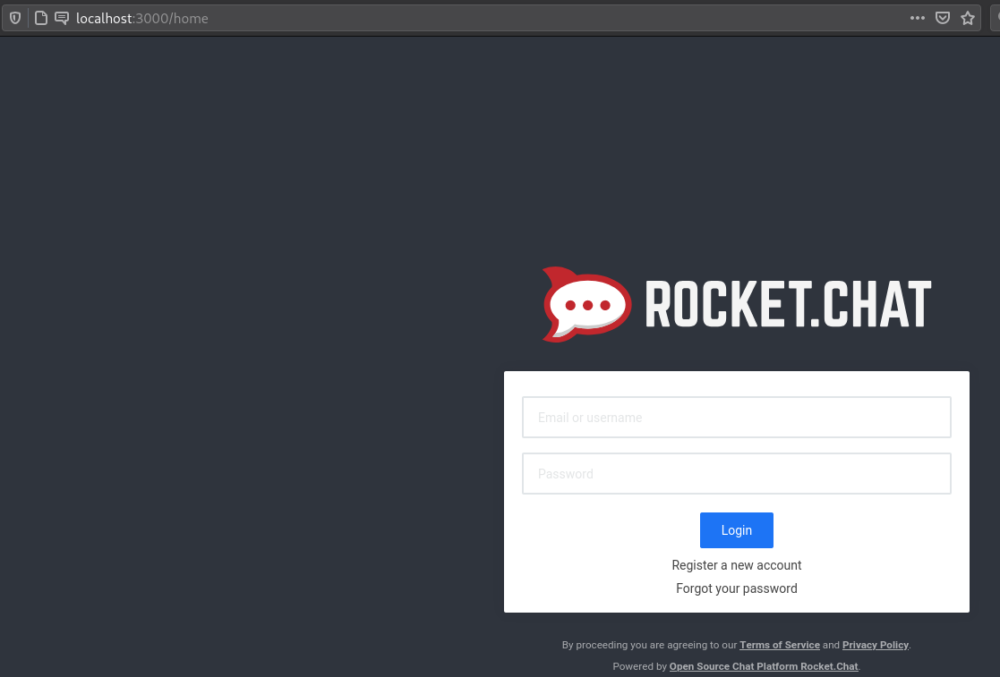
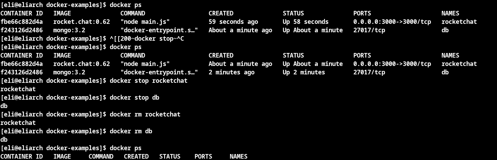
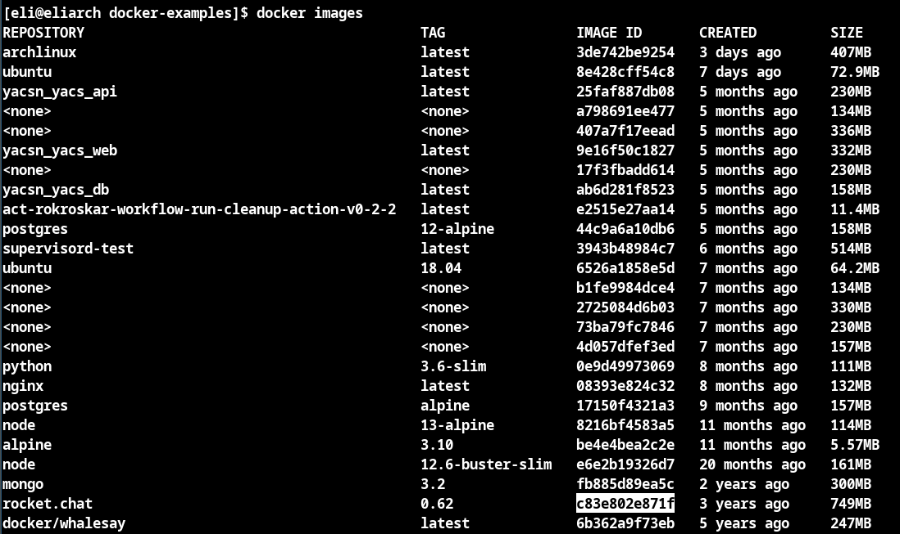
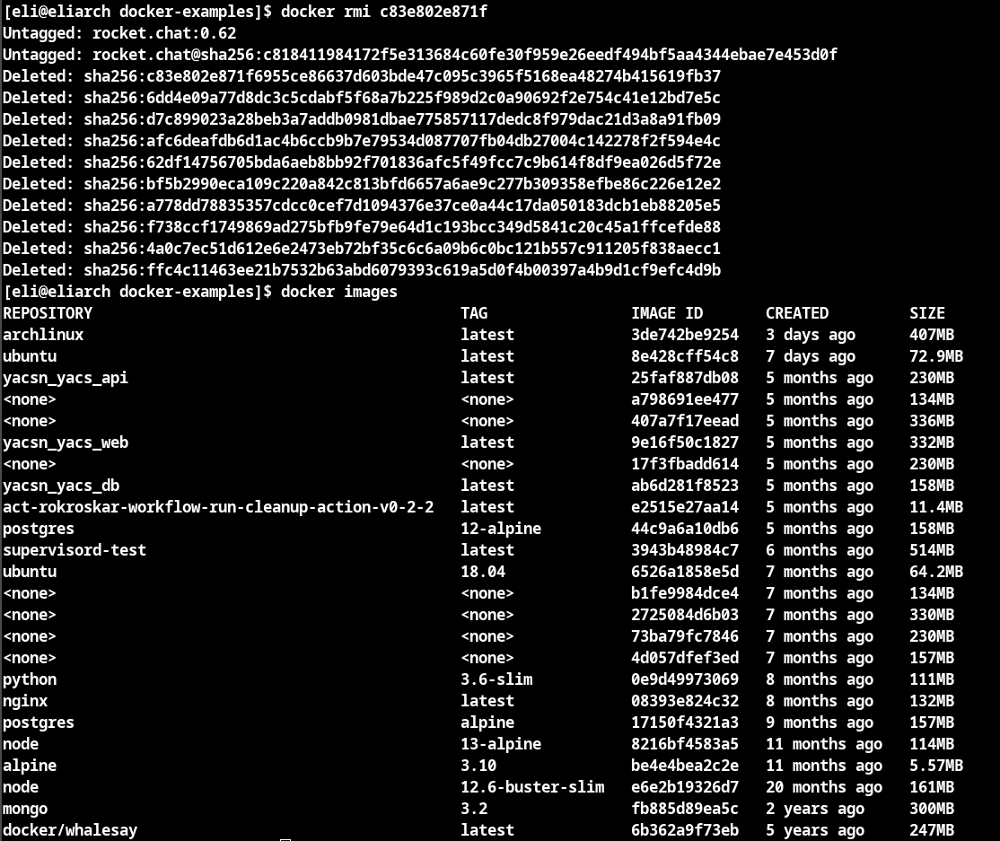
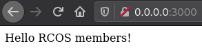
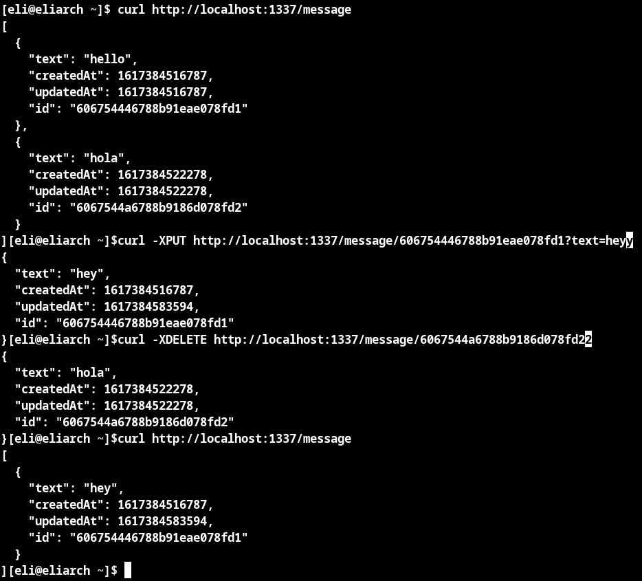

# Example00
Docker is running as expected

# Example01
Here you can see that I have vim installed inside my Ubuntu docker container. In addition I added a file called `test.txt` in the `/root` folder.

I also installed cowsay as you can see here

# Example02
Here is my local version of rocket chat running on port 3000

This shows the list of running docker containers as well as the steps to remove both of them.

This is the list of docker containers I have, note at the bottom rocket.chat exists

I now remove the rocket.chat image and it no longer exists

# Example03

Here you can see I have build and run the docker container. I first built it with `docker build -t testdocker .`
I was getting an issue where port 5000 was in use on my computer so I switched the command to `docker run -p 3000:5000 testdocker` which solved the problem and allowed me to view the website on my port 3000

# Example04

Here is the final output after everything is done showing it is working

[Here is my final Dockerfile](Dockerfile)

[Here is my final docker-compose.yml](docker-compose.yml)

