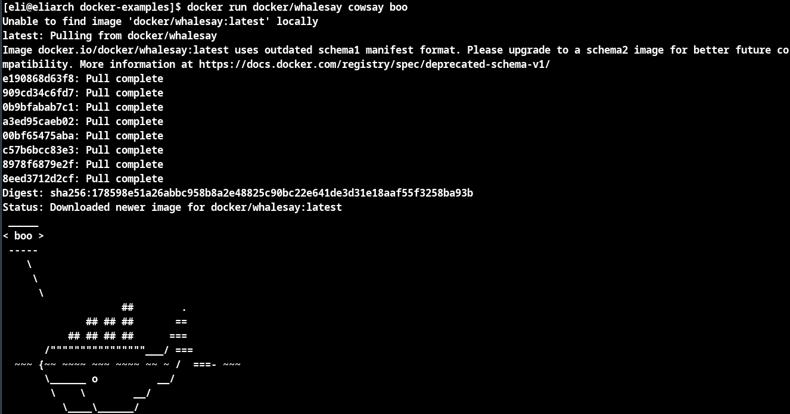
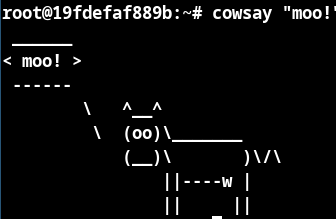

# Example00
Docker is running as expected

# Example01
Here you can see that I have vim installed inside my Ubuntu docker container. In addition I added a file called `test.txt` in the `/root` folder.

I also installed cowsay as you can see here

